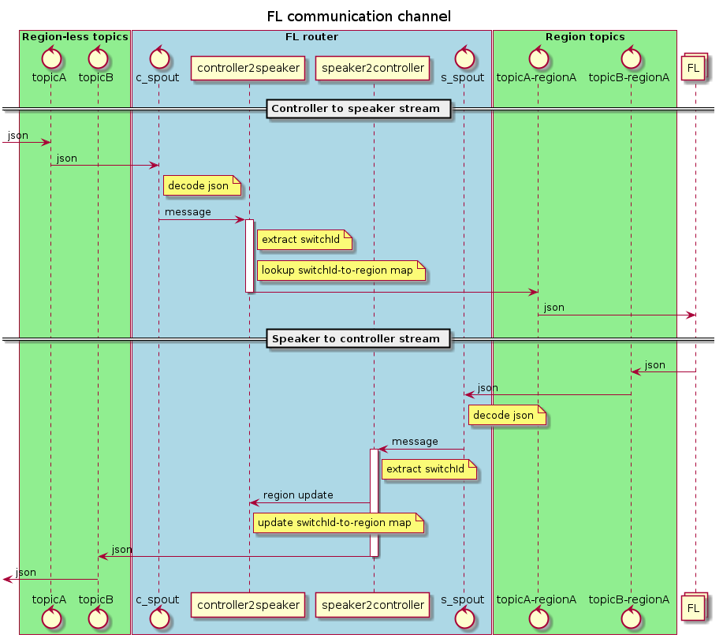
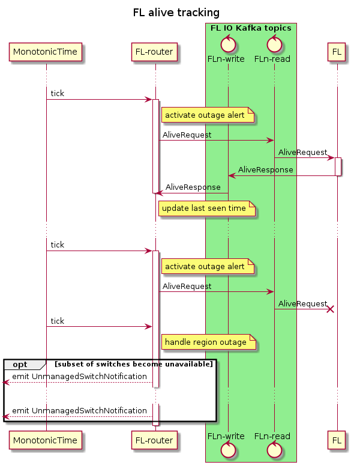
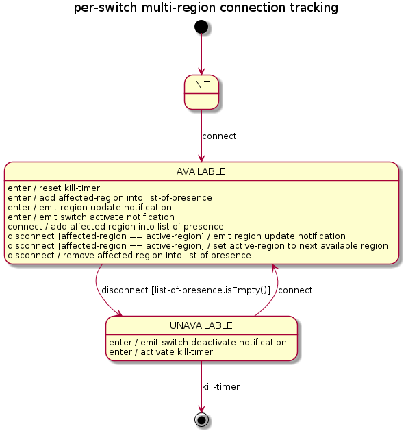

# FL parallelism

## Goals
- Have the ability to move FL instance closer to switch
- Remove Single point of failure
- Distribute the load to multiple instances (horizontal scale)
- Do high load testing

## Overall workflow
Each speaker-region is represented by speaker instance and the set of
"incoming" and the set of "outgoing" kafka-topics. Region's name is used as the
suffix for all these kafka-topic names.

FL-router can be treated as the set of parallel streams responsible for proxying
messages from the controller (all other storm topologies) to the speaker (one
specific speaker instance in a specific region that serve connection with
target switch). And the set of streams in opposite direction i.e. from the
speaker into the controller.

In other words, we have the set of 1-to-N kafka-topic streams and the set of
N-to-1 kafka-topics streams. The main responsibility of the FL-router is to
route the message into the region that serves the connection to the switch that
is the target of this message. Also, hide knowledge about this switch-to-region
mapping from all other services/topologies.  

## FL message/command kinds
1. Single switch command - operate with 1 switch, must be delivered into one
   region
1. Multi-switch commands - operate with several switches, must be delivered in
   all regions

## Make FL status sync
To keep network-discovery service in "up-to-date" state despite possible gaps
in the data passed from the speaker (due to connectivity issues between the
speaker and fl-router) to network-discovery, fl-router performs so-called
network sync. It emits "dump-all-switches" request into all regions with some
constant interval (1 minute by default). As a result, all speaker instances
on a regular basis send data about all connected switches including status
of all their ports. This data is used to update possible outdated switch(and
all ports) state inside the network-discovery service.

The open-kilda system has feature-toggle responsible for enabling/disabling the
mentioned above periodic network sync. It is used mainly by functional
tests.

**WARN:**

There is a strict requirement on the start order of open-kilda services
**if the network sync disabled**. The services must be started in the
following order:

* network topology
* fl-router topology
* FL (all regions)
* rest of the services.

This start order guarantees that network-topology will receive all switch
connect notification and will have the correct network view after the start.

## FL alive tracking
To be able to handle events not posted in kafka due to lost network
connection between FL and kafka, we need to track lost messages or FL
aliveness status (from FL-router point of view).

## FL data model
* region-id.

## FL-router data model
* list of "known" FL instances
* map connected switchId to the FL instance

# Master-master or simultaneous multi-region switch connection tracking

FL-router must track switch connection status by itself and produce "virtual"
connection status into all other open-kilda services. In this case, all
knowledge about multiple connections will be encapsulated inside FL-router and
all other services will continue to work with switches as if it has only 1
connection (i.e. in the same way as before).

There are 2 possible events that can/should be treated as availability
(unavailability) of switch in specific region. This is "connect" and "activate"
for availability and "deactivate" and "disconnect" for unavailability.
Depending from our expectation of speaker role for a specific switch in a
specific region, we should either use one pair or another. If we are tracking
the "equal" (master) role of the speaker, we should use the "activate" /
"deactivate" pair. If we are tracking the "slave" role we must use "connect"
/ "disconnect" pair.

For simplicity, we will use "connect" / "disconnect" events pair during
following explanation of the switch tracking process.

Data required to track switch connection:

* switch-id
* set-of-presence - regions that can be used to communicate with this switch
* active-region - region used to communicate with the switch

Connection tracking overall state diagram.

Real connection tracking code will not use FSM, because the state diagram is too
simple and full-featured FSM will bring useless complexity in implementation.
