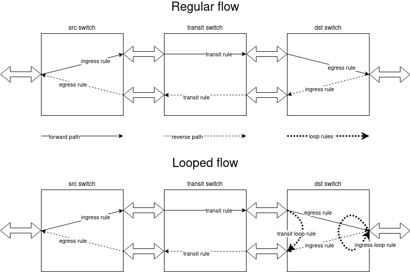

# Flow loop feature

## Overview

Flow loop feature designed for flow path testing. Loop provides additional flow rules on one of the terminating switch so any flow traffic is returned to switch-port where it was received. 
Such flow has `looped=true` flag and supports all flow operations. When the loop removed system should restore the original flow rules.

## API

* Get existing flow loops `GET /v2/flows/loop` with optional params `flow_id` and `switch_id`. Response example:

~~~
[ 
    {
        "switch_id": "00:00:11:22:33:44:55:66",
        "flow_id": "string"
    },
...
]
~~~

* Create flow loop on chosen switch `POST /v2/flows/{flow_id}/loop` with body 
~~~
{
  "switch_id": "00:00:11:22:33:44:55:66"
}
~~~
Flow may have only one loop.

* Delete flow loop and restore regular flow rules `DELETE /v2/flows/{flow_id}/loop`. 

## Details

From persistence perspective flow loop stored as two additional properties for flow node:  `looped: boolean` and `loop_switch_id: string`.

Flow loop create and delete operations implemented using H&S approach as separate hubs in `flow-hs` topology. All H&S flow operations use a single point of rule generation based on flow parameters. In current implementation it is `SpeakerFlowSegmentRequestBuilder` class. It should be modified to support the flow loop flag and reused in flow loop operations.

Additional loop rules have the flow cookie but different cookie type (0x00D) and higher priority. Only these rules are installed or deleted during flow loop operations.

Flow loop create FSM:

Flow loop delete FSM:

## Additional changes

Flow/switch validation/sync operations uses separate expected flow rules generation logic so it should be changed to support loop rules.

Protected flow may have a loop only on the main path. We need to remove loop rules related to the previous main path and install loop rules for the new main path during path swap.