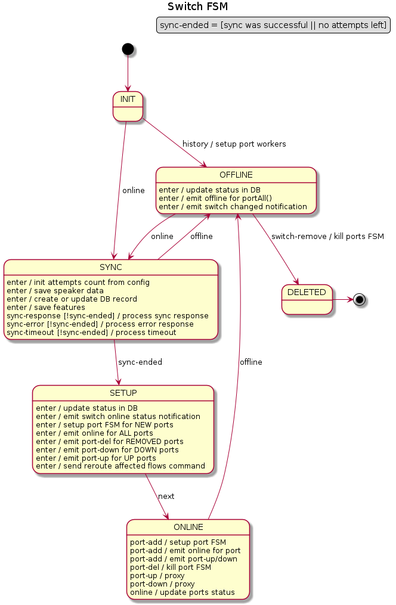
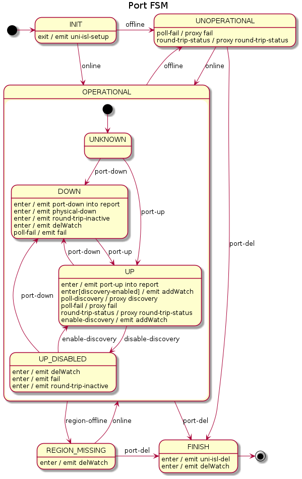
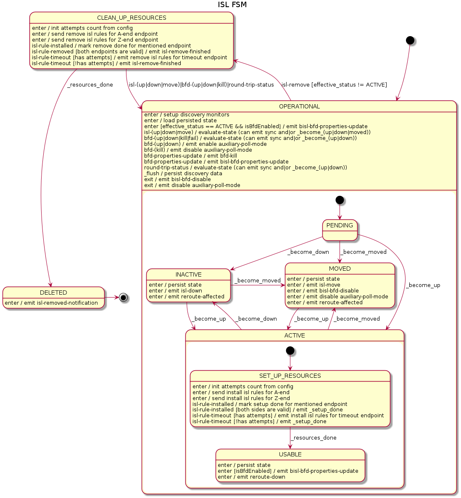
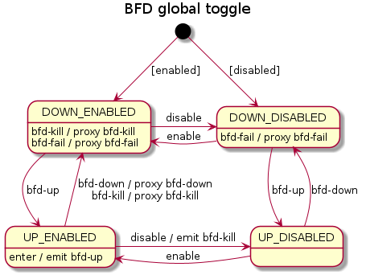
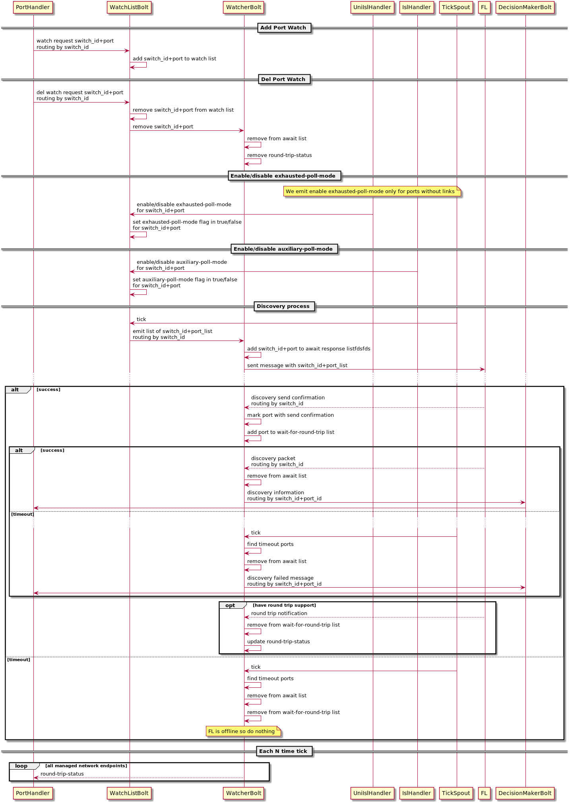

# Network discovery

## Overview
One of the main Open-Kilda task is automatic network discovery. The discovery 
process is not some one time action. We must be able to track and react on
topology change. I.e. new inter switch links (ISL) must be detected and used 
as possible route for existing and future flows. Corrupted (temporary or
permanently) ISLs must be detected too. All flows must be evacuated from such
ISLs.

Discovered ISL consist of:
* datapath + port-number (source)
* datapath + port-number (dest)
* link-speed
* link-latency
* BFD-support (and other optional capabilities)

Open-Kilda produce "discovery" packet (Ethernet+IP+UDP+LLDP), put inside source
datapath, source port-number, current time and send it using PACKET_OUT OF
message to the source switch and set as PORT_OUT source port-number in actions.

All switches have OF rule that match and send to controller our "discovery"
packets (using PACKET_IN message.

When controller receive "discovery" packet via PACKET_IN message it extract
source datapath and source port-number extract datapath and port-number 
(from PACKET_IN message) and treat it as destination datapath and destination
port-number. So now it have both ISL endpoints. Link speed is extracted from
current port-speed. Latency is calculated as current time minus packet create
time (extracted from packet) minus source switch latency (calculated by FL
using echo-request/response OF messages) minus dest switch latency. All
accumulated data used to create "discovery-event" and pass in into storm for
further processing.

This "process" is done for each enabled port of each switch on each N 
seconds(configuration parameter). As result we will receive 2 discovery
packets/event for each "link" - one for each direction. And because it repeats
periodically Open-Kilda can "detect" ISL-fails i.e. link-corruptions. And react
on them.

Network topology will/can use different delays between discovery requests. 
These delay depends on discovery history for specific switch+port:
 - if the last discovery was unsuccessful for port without links, 
 then the interval for the next discovery messages will be increased 
 until we get a successful one;
 - if BFD is active on this endpoint, then regardless of whether the discovery 
 is successful or not, the interval for discovery messages will be increased.
 
This is done in order to reduce the number of PACKET_OUT/PACKET_IN messages.

Only discovery events is not enough to "discover" all links in network, we need
to "know" the list of switches and list of their ports. This info is collected
from OF async messages - switch-add/remove, port-add/up/down/del.

## All events used in discovery process
* switch-added (ignored - have meaning only in multi-FL environment)
* switch-activated (alias switch-online)
* switch-deactivated (alias switch-offline)
* switch-removed (ignored - have meaning only in multi-FL environment)
* port-up
* port-down
* port-add (collect extra detail - port UP/DOWN status)
* port-delete
* port-other-update (ignored - must be translated into port-up/down event)

This events are wrapped into IslInfoData/PortInfoData messages and pushed into
storm for processing.

# Processing layers

Whole event processing is split into several layers or several nested finite
state machines. Each layer is responsible for some specific "function".

## Switch layer
Track switch online/offline status and track port change between switch reconnects.
Also, populate DB with switch objects (and directly related to them objects).

## Port anti-flapping layer
Detect and filter out port flapping events.

## Port events processor
Track port UP/DOWN state and control discovery poll process.
 

## Uni-ISL layer
Collect info about both ISL endpoint(by extracting remote point from discovery
events). Responsible for routing ISL event (correctly populate storm tuple with 
fields used in stream fields grouping), also responsible for tracking moved state.

## ISL events processor
Collect both discovery-event for both ISL directions, manage DB representation of
ISL, emit flows reroute on ISL discovery/fail.

## BFD port
Manage setup/remove BFD sessions

## BFD port global toggle
Responsible for global BFD toggle.

# Discovery poll process
Discovery poll represented by 3 services, each one responsible for some small
particular part.

## Watch list service
Keep the list of ISL endpoints (switch + port) available for the discovery
process i.e. The port event processor is responsible for managing add and for
remove events into this list. Periodically for each entry in this the list,
it produces request to the `watcher` service.

## Watcher service
This service track the state of the particular discovery request. Using request
from watch list service it produces discovery requests to the `speaker`.

Each produced discovery request contains a unique identifier, discovery sent
confirmation, discovery response and round trip notification are bring this
identifier back to the watcher service. If unique identifier extracted from one
of these responses is missing in the "wait" list of the watcher, this is
stale/foreign response and must be ignored. See the discovery sequence diagram
above for details.

Also watcher is responsible for tracking round trip status (this status is
represented with "last round trip received time" for each network endpoint). On
receive-round-trip event from the `speaker`, the watcher updates stored
round-trip-status.

With some constant time interval (1 second should be good default) watcher
emits round-trip-status for all managed by it network endpoints into port
handler (it is responsible to route it to correct ISL handler). ISL handler can
use this round-trip-status data to measure the affected time frame and use it
during ISL state evaluation. 

## Decision maker service

The decision-maker collects and aggregates events from the `watcher` service.
